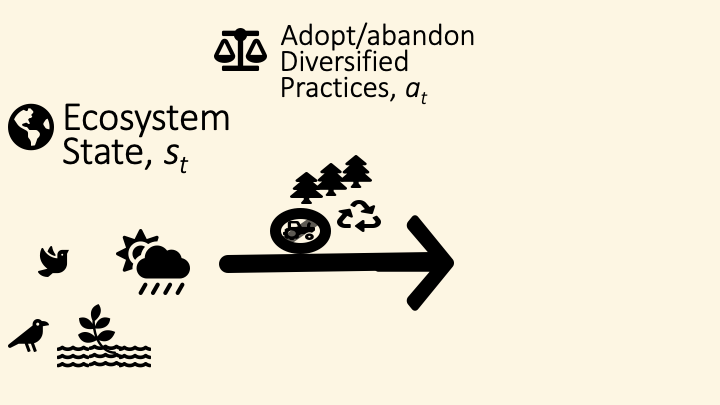
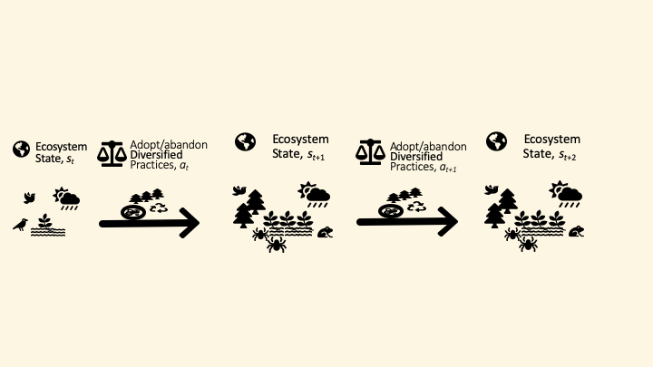
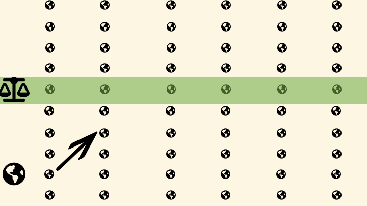
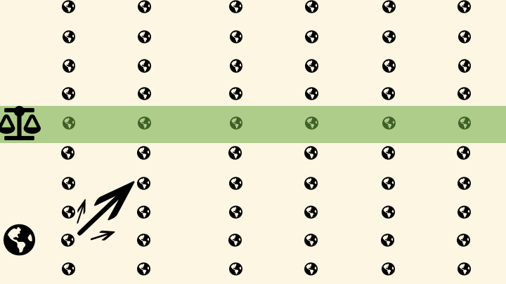
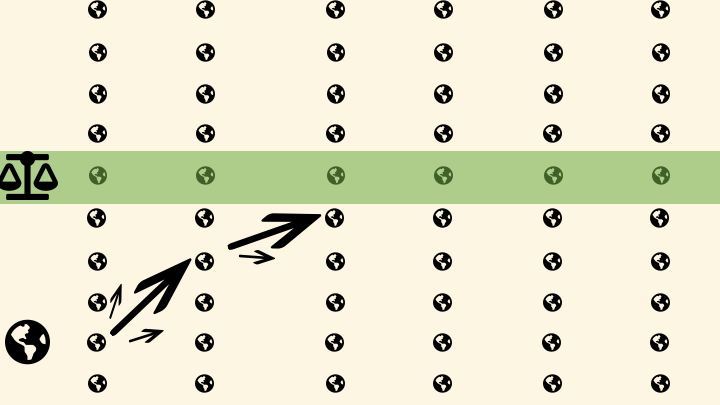
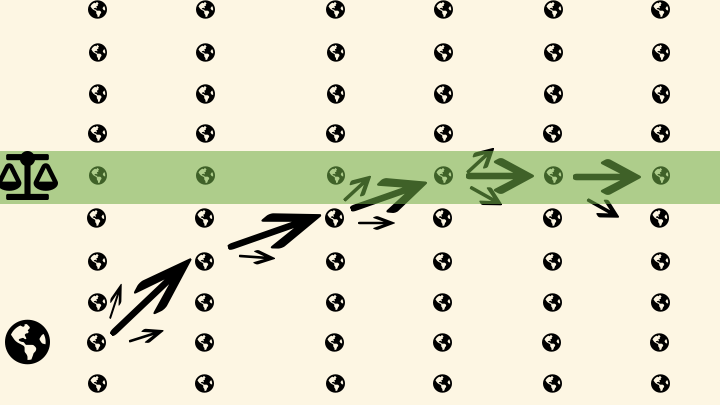

```{r setup, include=FALSE}
knitr::opts_chunk$set(#dev.args=list(bg="transparent"), 
                      echo = FALSE, 
                      message=FALSE, 
                      warning=FALSE,
                      fig.width=11, 
                      fig.height=6.5, 
                      cache = TRUE)

library(tidyverse)
library(ggthemes)
library(magick)
theme_set(theme_solarized(base_size=16))
scale_colour_discrete <- function(...) scale_colour_solarized()
scale_fill_discrete <- function(...) scale_fill_solarized()
pal <- solarized_pal()(6)

txtcolor <- "#586e75"


library(patchwork)

ggimage <- function(path, transparent = FALSE){
  img <- magick::image_read(path)
  if(transparent)  img <- magick::image_transparent(img, "white")
  ggplot2::ggplot() + 
  ggplot2::annotation_raster(img, 
                    xmin=-Inf, xmax=Inf, ymin=-Inf, ymax=Inf) +
    theme(axis.line = element_blank(), 
          panel.background = element_blank(),
          axis.ticks = element_blank(), 
          axis.text = element_blank(), 
          axis.title = element_blank())
  
}


ggblank <- function() ggplot() + geom_blank() + 
  theme(axis.line = element_blank(), panel.background = element_blank())

```

layout: true
background-color: #fdf6e3
class: center, top

---

# From Oceans to Fields: 
## Socio-ecological Decision Making for the 21st Century


<div class="my-footer">

<a href="https://carlboettiger.info"> `r icon::fa("user")` Carl Boettiger</a> | 
<a href="https://berkeley.edu"> `r icon::fa("briefcase")` UC Berkeley</a> | 
<a href="https://twitter.com/cboettig"> `r icon::fa("twitter")` @cboettig</a>

</div>

---

```{r fig.width=11, fig.height=3.5}
ggimage("../image-library/noaa/noaa_fisheries.jpg") + 
  geom_text(aes(x = 10, y = 10), label = "Fisheries", size=50, col="white")
```

```{r fig.width=11, fig.height=3.5}
ggimage("../image-library/img/organic-farm.jpg") + 
  geom_text(aes(x = 10, y = 10), label = "Farming", size=50, col="white")
```


---
layout: false
background-image: url(../image-library/noaa/noaa_fisheries.jpg)
background-position: center
background-size: 180%
class: left, top, inverse

# Fisheries Management

<div class="credit">
image: NOAA
</div>


---
layout: true
background-color: #fdf6e3
class: center, top

---
class: center, middle


## Managing Fisheries Under Uncertainty: A History of Paradox

---


## MSY (Schaefer 1954)

```{r msy1, echo=FALSE}

r <- 1
K <- 100
H <- r * K / 4
unfished <- function(N) r * N * (1 - N / K) 
logistic <- function(N) r * N * (1 - N / K) - H
msy <- tibble(population_size = 0:100, 
           growth_rate = unfished(population_size),
           F = r * population_size / 2)
msy %>%
  ggplot(aes(population_size, growth_rate)) + 
  geom_path(size=3, col = pal[[1]]) +
  coord_cartesian(ylim=c(0,40)) + 
  xlab("population size") + ylab("growth rate")

 
```


---


## MSY (Schaefer 1954)

```{r msy2, echo=FALSE}
msy %>%
  ggplot(aes(population_size, growth_rate)) + 
  geom_path(size=3, col = pal[[1]]) +
  geom_vline(aes(xintercept = K/2), lty = "dashed", 
             size = 2, col = pal[[2]]) +
  geom_text(aes(x = K/2 - 3, y= 10, 
                label = "B[MSY]==K/2"),
            parse = TRUE, angle=90, col = pal[2],size=14) +
  coord_cartesian(ylim=c(0,40)) + 
  xlab("population size") + ylab("growth rate")
 
```

$$ H = F \cdot B $$

---


## MSY (Schaefer 1954)

```{r msy3, echo=FALSE}
msy %>%
  ggplot(aes(population_size, growth_rate)) + 
  geom_path(size=3, col = pal[[1]]) +
  geom_hline(aes(yintercept = r * K / 4), lty = "dashed", 
             size = 2, col = pal[[3]]) + 
  geom_text(aes(y = r*K/4 - 2, x = 15, 
                label = "H[MSY]==rK/4"),
            parse = TRUE, col = pal[3], size = 14) + 
  geom_vline(aes(xintercept = K/2), lty = "dashed", 
             size = 2, col = pal[[2]]) +
  geom_text(aes(x = K/2 - 3, y= 10, 
                label = "B[MSY]==K/2"),
            parse = TRUE, angle=90, col = pal[2],size=14) + 
  coord_cartesian(ylim=c(0,40)) + 
  xlab("population size") + ylab("growth rate")
 
```


---

## MSY (Schaefer 1954)

```{r msy4, echo=FALSE}
msy %>%
  ggplot(aes(population_size, growth_rate)) + 
  geom_path(size=3, col = pal[[1]]) +
  xlab("population size") + ylab("growth rate") + 
  coord_cartesian(ylim=c(0,40)) + 
  geom_vline(aes(xintercept = K/2), lty = "dashed", 
             size = 2, col = pal[[2]]) +
  geom_text(aes(x = K/2 - 3, y= 10, 
                label = "B[MSY]==K/2"),
              parse = TRUE, angle=90, col = pal[2],size=14) + 

  geom_hline(aes(yintercept = r * K / 4), lty = "dashed", 
             size = 2, col = pal[[3]]) + 
  geom_text(aes(y = r*K/4 - 2, x = 15, 
                label = "H[MSY]==rK/4"),
            parse = TRUE, col = pal[[3]], size = 14) + 

    geom_line(aes(y = F), size = 3, lty = "dashed", 
              col = pal[[6]])  + 
  geom_text(aes(y = 5, x = 15, angle=90*40/100,
                label = "F[MSY]==r/2"),
            parse = TRUE, col = pal[[6]], size = 14)
 
```

---

## Constant Escapement (Clark 1973)

```{r}
clark_harvest <- function(N){ pmax(N - K/2, 0)} 
const_escape <- function(N) pmin(N, K/2)
clark <- tibble(population_size = 0:100, 
           growth_rate = unfished(population_size),
           escapement = const_escape(population_size))

clark %>%
  ggplot(aes(population_size, escapement)) + 
  geom_path(size=3, col = pal[[1]]) +
  xlab("population size") + ylab("escapement (B - H)") + 
  coord_cartesian(ylim=c(0,60))
```


---

## Constant Escapement (Clark 1973)


```{r}

clark %>%
  ggplot(aes(population_size, escapement)) + 
  geom_path(size=3, col = pal[[1]]) +
  xlab("population size") + ylab("escapement (B - H)") + 
  coord_cartesian(ylim=c(0,60)) + 
 geom_vline(aes(xintercept = K/2), lty = "dashed", 
             size = 2, col = pal[[2]]) +
  geom_text(aes(x = K/2 - 3, y= 10, 
                label = "B[MSY]==K/2"),
              parse = TRUE, angle=90, col = pal[2],size=10) + 

  geom_hline(aes(yintercept = K / 2), lty = "dashed", 
             size = 2, col = pal[[3]]) + 
  geom_text(aes(y = K/2 - 2, x = 15, 
                label = "B[MSY]"),
            parse = TRUE, col = pal[[3]], size = 10)  + 
   geom_text(aes(y = 5, x = 15, angle=90*40/100,
                label = "H==0"),
            parse = TRUE, col = pal[[1]], size = 10)
```

---

## Stochastic growth (Reed 1979)

```{r fig.height=3, fig.width=6}
ggimage("../image-library/published/reed1979.png", TRUE)
```

--

```{r fig.height=4}
clark %>%
  ggplot(aes(population_size, escapement)) + 
  geom_path(size=3, col = pal[[1]]) +
  xlab("population size") + ylab("escapement (B - H)") + 
  coord_cartesian(ylim=c(0,60))
```

---


## Stochastic growth (Reed 1979)

```{r fig.height=3, fig.width=6}
ggimage("../image-library/published/reed1979.png", TRUE)
```

### Introducing uncertainty != more cautious harvesting

#### Is uncertainty truly negligible?

---

## Adding more uncertainty (Clark & Kirkwood 1986)

> An important tacit assumption in Reed’s analysis, as in the other works referred to above, is that the recruitment level X is known accurately prior to the harvest decision, [...] In the case of fishery resources, the stock level X is almost never known very accurately, owing to the difficulty of observing fish in their natural environment.

-- <i>Clark & Kirkwood 1986</i>

### In which tackling the first paradox...

---

### ... leads to another paradox paradox! 


```{r fig.height=5.5}
ggimage("../image-library/published/clark1987.png", TRUE)
```

--

> The above results appear to **contradict the conventional wisdom** of renewable resource management, under which high uncertainty would call for increased caution in the setting of quotas.

-- <i>Clark & Kirkwood 1986</i>

---

## "Simplifying Assumptions" 

### How did we get here?

> For reasons of tractability, we shall adopt the simplifying assumption that the escapement level S is known exactly at the end of that period. (The mathematical difficulty of the problem increases markedly if this assumption is relaxed.)

-- <i>Clark & Kirkwood 1986</i>


---

## Complete Measurement Uncertainty 


```{r fig.height=5.5}
ggimage("../image-library/published/sethi2005.png", TRUE)
```

--

> It may seem counter-intuitive that a measurement error causes lower expected escapements below the deterministic fishery closure threshold.

-- Sethi, Costello et al, 2005


---

## How did we get here again?

> We should also note the somewhat misleading use of the term "optimal policy" in this context. Specifically, Assumption 3 states that the manager **uses only the current measurement when forming expectations**. This assumption implies that the current measurement is the only state variable for the manager’s problem. Past measurements may contain some information about the current stock; a more sophisticated manager would use that information in forming expectations. 

--

### So why did we do that?

--

> Second, the optimization problem for a manager who uses past measurements is very complicated...

---

## Meanwhile...


```{r}
ggimage("../image-library/published/smallwood-sondik-1973.png", TRUE)
```

---

## 20 years later...


```{r}
ggimage("../image-library/published/thrun-1992.png", TRUE) + ggtitle("Thrun 1992")
```

---

## DARPA 2005 Autonomous Vehicle Challenge

```{r}
ggimage("../image-library/img/self-driving-darpa-2005.jpg")
```


#### "Stanely," Stanford Racing Team led by Sebastian Thrun 

---

## So back to fisheries...


```{r}
ggimage("../image-library/noaa/noaa_tuna.jpg")
```


---


```{r jetstream, fig.height=8}
ggimage("../image-library/img/jetstream.jpg") +
  ggimage("../image-library/img/self-driving.png") + 
  plot_layout(ncol = 1)
```


---

## Damn the complexity, full speed ahead!

```{r pomdp_policies}
policies_w_priors <- readr::read_csv("../talks-2019-theory/data/policies_w_priors.csv")

df <- policies_w_priors %>% select(-harvest) %>%
  gather(panel, value, -state, -policy) %>%
  rename(method = policy) 

policy <- df %>% filter(panel == "escapement")
prior <- df %>% filter(panel == "prior") %>% 
  mutate(method = fct_recode(method, 
                             "POMDP high" = "POMDP: high prior",
                              "POMDP low" = "POMDP: low prior"))
```


```{r, fig.height=5, fig.width=9}
p1 <- policy %>% filter(method == "CE") %>%
  ggplot(aes(state,value, col=method)) + 
  geom_line(lwd=3, alpha = 0.9, show.legend = FALSE) + 
   xlab("observed stock size") +
   ylab("policy")+
  coord_cartesian(xlim = c(0,1), ylim = c(0,.8))
p1 +  ggblank() 

```


---

## A resolution to the paradox!

```{r, fig.height=5, fig.width=9}
p1 <- policy %>% filter(method != "TAC") %>%
  ggplot(aes(state,value, col=method)) + 
  geom_line(lwd=3, alpha = 0.9, show.legend = FALSE) + 
   xlab("observed stock size") +
   ylab("policy")+
  coord_cartesian(xlim = c(0,1), ylim = c(0,.8))

p2 <- prior %>% filter(method != "TAC") %>%  
  ggplot(aes(state,value, col=method)) + 
  geom_line(lwd=3, alpha = 0.9) + 
  xlab("true stock size") +
   ylab("belief probability") +
  coord_cartesian(xlim = c(0,1), ylim = c(0,.8)) + 
  guides(col = guide_legend(nrow=2)) + 
  theme(legend.position = "bottom")
p1 +  (ggblank() / p2)

```

Memarzadeh & Boettiger (2019)
---


## Comparison to "constant mortality" rule 

```{r, fig.height=5, fig.width=9}
p1 <- policy %>% filter(method %in% c("CE","TAC")) %>%
  ggplot(aes(state,value, col=method)) + 
  geom_line(lwd=3, alpha = 0.9) + 
   xlab("observed stock size") +
   ylab("policy") +
  coord_cartesian(xlim = c(0,1), ylim = c(0,.8))

p1 +  ggblank() 

```


---

## Future of Fish

```{r}
ggimage("../image-library/published/costello-2016.png", TRUE)
```

---

```{r}
ggimage("../image-library/published/pnas-2019-fig1.png")
```


Memarzadeh et al, 2019 <i>PNAS</i>

---

### Forecast outcomes by location and taxon

```{r}
ggimage("../image-library/published/pnas-2019-fig2.png")
```


Memarzadeh et al, 2019 <i>PNAS</i>

---

### Life history and environmental sensitivity influence impact


```{r}
ggimage("../image-library/published/pnas-2019-fig3.png")
```

Memarzadeh et al, 2019 <i>PNAS</i>


---

## Does this really contradict Costello et al?

--

```{r fig.height=5.5, fig.width=10}
ggimage("../image-library/published/costello-2016.png", TRUE)
```

### Rights-Based Fisheries Management


---

## Setting Total Allowable Catch (TAC) 

### Rights-Based Fisheries Management

--

> the optimal TAC at each point of time corresponds to the maximization of the quota share price, provided, of course, that the Individual Transferable Quota (ITQ) property rights are of sufficiently high quality. 

--

> This implies that the TAC-setting authority does not have to engage in extensive data collection and calculations to set the best possible TAC. It only needs to adjust the TAC until the share quota price is maximized. 


-- Arnason 2012

---
class: left

## Decision-Making in Fisheries Management: Reflections

--

#### Dangers of certain simplifying assumptions

--

#### Theoretical, algorithmic, and computational advances in other fields can improve ecological decisions

--

#### Do these decisions really come from technology or human behavior?

--
 
*POMDP solution is qualitatively far more intuitive!*


---
layout: false
background-image: url(../image-library/img/factory-farm.jpg)
background-position: center
background-size: 140%
class: center, middle, inverse

# Individual Decision-Making: Adoption of Diversified Farming Systems

<div class="credit">
image: Yann Arthus-Bertrand
</div>

---
layout: false
background-image: url(../image-library/img/organic-farm.jpg)
background-position: center
background-size: 140%
class: center, middle, inverse

# Adoption in Diversified Farming Systems

<div class="credit">
image: Yann Arthus-Bertrand
</div>


---
layout: true
background-color: #fdf6e3
class: center, top
---

# Diversified Farming Systems

```{r}
ggimage("../image-library/published/dfs-rosa-2019.png", TRUE)
```

<i>Rosa Schleich et al (2019), Ecological Economics</i>

---
class: center, middle

## What factors most influence the adoption of Diversified Practices?


---
class: left, top

.pull-left[

## Diversified Farming Practices

- `r icon::fa("leaf")` Cover crops
- `r icon::fa("recycle")` Crop rotation
- `r icon::fa("chess-board")` reduced tillage
- `r icon::fa("tree")` Agroforestry
- `r icon::fa("map")` Hedge rows 
- `r icon::fa("crow")` Mixed crop-livestock
- `r icon::fa("seedling")` Organic agriculture
- `r icon::fa("gem")` Conservation agriculture
- ...

]
.pull-right[

## Ecosystem Services

- `r icon::fa("dove")` higher biodiversity
- `r icon::fa("bug")` improved pest control
- `r icon::fa("seedling")` weed control & soil health
- `r icon::fa("map")` reduced soil erosion
- `r icon::fa("apple")` improved nutrient management
- `r icon::fa("recycle")` carbon sequestration
- `r icon::fa("globe")` increased resilience

- `r icon::fa("seedling")` yield improvement
- `r icon::fa("truck")` reduced fertilizer input
- `r icon::fa("dollar-sign")` higher profitability and less risk

]


<i>Rosa Schleich et al (2019), Ecological Economics</i>


---

## Markov Decision Process Model


---

## Markov Decision Process Model




---

## Markov Decision Process Model


---

## Markov Decision Process Model



---

## Markov Decision Process Model


---

## Markov Decision Process Model



---

## Markov Decision Process Model



---

## Markov Decision Process Model




---

## Markov Decision Process Model




---
## A simple decision rule emerges:

```{r fig.width=7, fig.height=5}
df <- read_tsv("../../boettiger-lab/dfs-mdp/data/fig0.tsv.gz")
df %>% ggplot(aes(state,action)) + geom_point() +
  coord_cartesian(xlim = c(0,1))
```


---

## Tipping Point Dynamics?

```{r}
sims <- read_tsv("../../boettiger-lab/dfs-mdp/data/fig1.tsv.gz")

sim_plot <- function(sims, title = ""){

actions <- seq(0, 1, length = 100)
states <- seq(0, 1.5, length = 100) 

df <- sims %>% 
    select(-obs,-value) %>% # tidy
    mutate(state = states[state], action = actions[action]) # rescale
  
   panelA <- df %>% 
    ggplot(aes(time, state, group = reps, col=time)) + 
    geom_path(alpha=0.1, show.legend = FALSE) + ggtitle(title)
   
   Tmax <- max(sims$time)
   panelB <- df %>% filter(time %in% c(1, Tmax))  %>%
     ggplot() + geom_density(aes(state, group = time, fill = time), alpha=0.8) + 
     scale_fill_continuous(breaks=c(1,10)) +
     coord_flip()
   
  panelA + panelB + plot_layout(widths = c(3, 1))
}
sim_plot(sims)

```


---

## Role of land tenure

### Short (2-yr) land tenures:

```{r}
sims_2yr <- read_tsv("../../boettiger-lab/dfs-mdp/data/fig2.tsv.gz")
sim_plot(sims_2yr)

```


---

## Role of land tenure

### Long tenures / ownership

```{r}
sims <- read_tsv("../../boettiger-lab/dfs-mdp/data/fig1.tsv.gz")
sim_plot(sims)
```

---

## How would subsidies influence adoption of diversified practices?


--

### **Scenario A**: High value incentive (reducing cost of diversified practice) over short duration (2 years)

--

### **Scenario B**: Small subsidy sustained over longer duration (10 years)

---

## How would subsidies influence adoption of diversified practices?

### large subsidy over 2 years

```{r}
read_tsv("../../boettiger-lab/dfs-mdp/data/fig3A.tsv.gz") %>% sim_plot()
```

---

## How would subsidies influence adoption of diversified practices?

### smaller subsidy over 10 years

```{r}
read_tsv("../../boettiger-lab/dfs-mdp/data/fig3B.tsv.gz") %>%
  sim_plot()
```


---
class: left, top

# Future of Decisions

--

#### Artificial intelligence meets fisheries ...

--

#### Or would rights-based fisheries already be self-driving cars?

--

####  Diversified farming: individual decisions vs policy scenarios

--

*<i>What if decisions algorithms actually made decisions?</i>*

---

# Ethics and Algorithms in Ecological Conservation & Management?


---

# Reproducibility

--

<https://github.com/boettiger-lab/pomdp-intro>


---

# Reproducibility


---

# Reproducibility
   

 


---

# Acknowledgements

.pull-left[

```{r fig.width=6, fig.height=6}
(ggimage("../image-library/people/milad.png") +
ggimage("../image-library/people/millie.png")) / 
(ggimage("../image-library/people/serge.png") +
ggimage("../image-library/people/claire-kremen.jpg", TRUE))
```


```{r fig.width=8, fig.height=2}
plot_spacer() + 
  #ggimage("../image-library/people/allison_horst_artist.jpg") + xlab("Allison Horst") + 
  ggimage("../image-library/sponsors/royalsociety.jpg") + ylab("Image Credits")  +
  ggimage("../image-library/sponsors/noaa.png", TRUE) + plot_layout(ncol=4) +
  plot_spacer()

```

]
.pull-right[

```{r fig.width=6, fig.height=3}
ggimage("../image-library/people/dfs-cnh.jpg") 
```


```{r fig.width=12, fig.height=6}
(ggimage("../image-library/sponsors/nsf.png")  +     
 ggimage("../image-library/sponsors/bids.png", TRUE) +
 ggimage("../image-library/sponsors/jetstream-logo.svg", TRUE)
)  /     
(ggimage("../image-library/sponsors/hellman.png")  +    
 ggimage("../image-library/sponsors/berkeley.png")
)

  
```
]